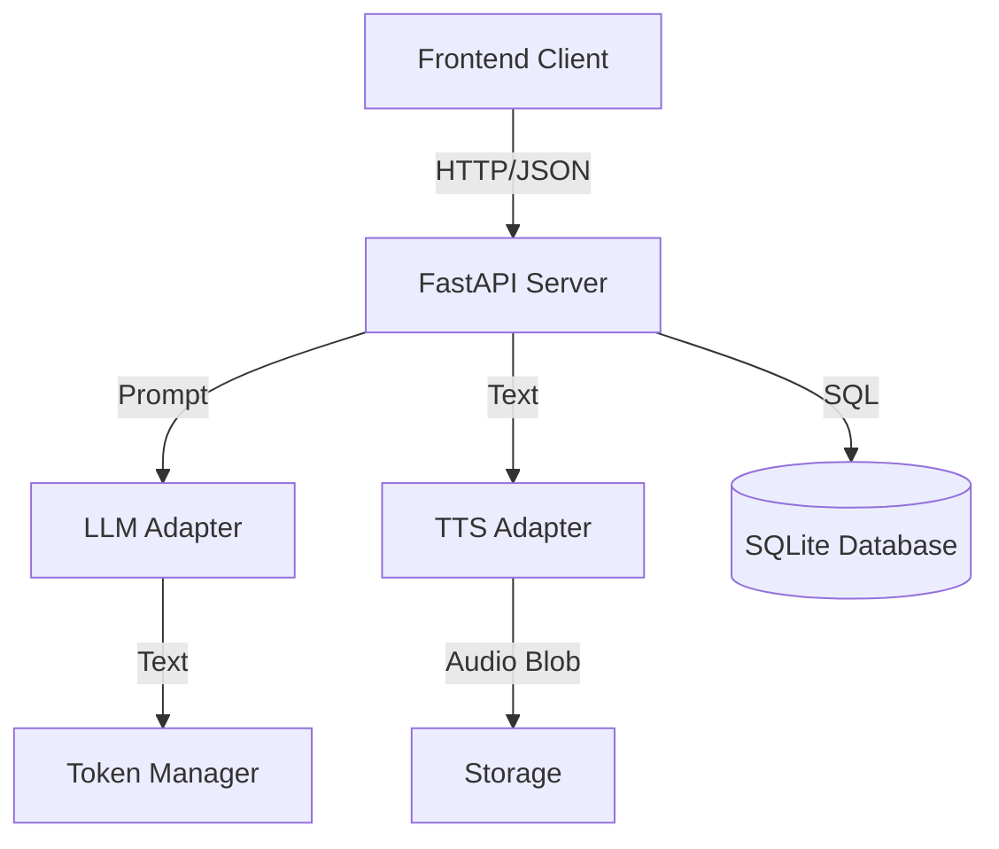

# Waifu-RT3D v5.31: The Ultimate AI Companion Platform

   

> **"Not just a chatbot. A living, breathing digital entity."**

**Waifu-RT3D** is a commercial-grade, unparalleled web application that bridges the gap between static LLM chat and immersive 3D experiences. Built on a hybrid architecture of **FastAPI** (Python) and **Three.js** (JavaScript), it delivers real-time, hardware-accelerated anime avatars that listen, speak, and emote.

This documentation is exhaustive. It covers every aspect of the system from high-level philosophy to low-level database schemas.

---

## 📚 Table of Contents

1. [Project Manifesto](#-project-manifesto)
2. [What's New in v5.31](#-whats-new-in-v531)
3. [Hardware Requirements & Tiers](#-hardware-requirements--tiers)
4. [Installation Guide](#-installation-guide)
   - [Prerequisites](#prerequisites)
   - [Step-by-Step Setup](#step-by-step-setup)
   - [The LM Studio Connection](#the-lm-studio-connection)
5. [The Waifu-RT3D Experience](#-the-waifu-rt3d-experience)
   - [The Neon Interface](#the-neon-interface)
   - [The Classic Dashboard](#the-classic-dashboard)
   - [3D Interaction Controls](#3d-interaction-controls)
6. [Configuration Manual](#-configuration-manual)
   - [app.json Reference](#appjson-reference)
   - [Audio Settings](#audio-settings)
7. [System Architecture](#-system-architecture)
   - [Backend Topology](#backend-topology)
   - [Database Schema (V5)](#database-schema-v5)
   - [Frontend Module Graph](#frontend-module-graph)
8. [API Documentation](#-api-documentation)
9. [Developer Guide](#-developer-guide)
10. [Troubleshooting & FAQ](#-troubleshooting--faq)

---

## 🌟 Project Manifesto

We are building the future of Human-AI interaction. Most "AI" apps are just text boxes that stream tokens. **Waifu-RT3D** is different.

### 1. Visually Stunning

We refuse to accept "good enough". Using **Three.js r160+** and **VRM 1.0**, we render high-fidelity 3D avatars with custom shaders, blooms, and physics-based hair/cloth simulation. The interface is a "Neon Cyberpunk" glassmorphism masterpiece, designed to feel like a heads-up display from the year 2077.

### 2. Deeply Personable

Characters in Waifu-RT3D aren't just system prompts. They are complex entities with:

- **Distinct Voices**: Every character has a unique neural TTS profile (Pitch, Speed, Timbre).
- **Persistent Memories**: (In Development) Interactions are stored in a vector database, allowing the AI to recall facts from weeks ago.
- **Emotional Range**: The AI analyzes the sentiment of its own replies to trigger animations (Joy, Anger, Surprise) in real-time.

### 3. Privacy First

Your Waifu lives on **your** hardware. By leveraging local LLMs (via LM Studio/Ollama) and local TTS engines, no conversation data is ever sent to a cloud server. You own the experience entirely.

---

## 🚀 What's New in v5.31

The **"Hybrid"** Update brings huge changes:

- **Dual-Frontend Architecture**:
  - `Neon` (Default): The consumer-facing, high-end UI.
  - `Classic` (`/classic`): The developer diagnostic tool.
- **Unified Backend**: A single `server.py` now serves both interfaces and manages the API.
- **Database Schema V5**: Refactored SQLite layout for robust session management.
- **VRM 1.0 Support**: Full compatibility with the latest VRM standard (A-Pose correction included).
- **Material Design 3**: Complete CSS overhaul for the Neon UI.

---

## 💻 Hardware Requirements & Tiers

We check your hardware on startup and adjust features accordingly.

### Tier 1: Apple Silicon (MacBook Air/Pro M1/M2/M3)

*Target: Efficient, Low-Power, Low-Latency.*

| Component | Recommendation |
| :--- | :--- |
| **Processor** | M1 Pro / M2 / M3 |
| **RAM** | 16GB Unified Memory (32GB Recommended for 13B Models) |
| **LLM** | 4-bit Quantized Models (7B parameters) running on Metal (MPS). |
| **TTS** | **Sherpa-ONNX** (CPU Optimized) or System **AVFoundation**. |
| **Animation** | Procedural Idle + Standard Blendshapes. |
| **ASR** | Whisper-Base (CoreML Optimized). |

### Tier 2: NVIDIA Workstation (RTX 3060/4090/5080)

*Target: Maximum Fidelity, Broadcast Quality.*

| Component | Recommendation |
| :--- | :--- |
| **GPU** | RTX 3060 (12GB VRAM) Minimum. RTX 4090 Preferred. |
| **RAM** | 32GB DDR4/DDR5 |
| **LLM** | FP16 or 8-bit Models (13B - 70B) running on CUDA. |
| **TTS** | **XTTS v2** (Coqui) or **RVC** (Voice Conversion) for realistic anime voices. |
| **Animation** | **AI Motion Diffusion**: Generates unique gestures on the fly. |
| **ASR** | Whisper-Large-v3 (Real-time). |

---

## 📦 Installation Guide

### Prerequisites

1. **Python 3.11+**:
   - Verify with `python --version`.
   - If older, please upgrade via `brew install python@3.11` (Mac) or the Windows Store.

2. **Git**:
   - Required to clone the source code.

3. **LM Studio**:
   - This is the "Brain" of the operation.
   - Download from [lmstudio.ai](https://lmstudio.ai/).
   - **CRITICAL**: You must enable the Local Inference Server in LM Studio (Sidebar -> `<->` Icon -> Start Server). Port **1234**.

### Step-by-Step Setup

#### 1. Clone the Repository

Open your terminal (Terminal.app or PowerShell) and run:

```bash
git clone https://github.com/WestonGFX/waifu-rt3d.git
cd waifu-rt3d
```

#### 2. Create a Virtual Environment

It is highly recommended to isolate the project dependencies.

```bash
python -m venv venv
# On Mac/Linux:
source venv/bin/activate
# On Windows:
venv\Scripts\activate
```

#### 3. Install Python Dependencies

This pulls in FastAPI, Uvicorn, SQLite utilities, and AI adapters.

```bash
pip install -r requirements.txt
```

*Note: This may take a few minutes depending on your internet connection.*

#### 4. Initialize the Database

We need to create the `waifu.db` file and populate it with the starter characters (Rin, Nyx, etc.).

```bash
python tools/init_personas.py
```

**Expected Output:**

```text
[INFO] Database initialized at backend/storage/waifu.db
[INFO] Injected Character: Rin (ID 1)
[INFO] Injected Character: Nyx (ID 2)
...
[SUCCESS] Initialization Complete.
```

#### 5. Launch the Server

Start the unified backend.

```bash
python backend/server.py
```

**Expected Output:**

```text
INFO:     Started server process [12345]
INFO:     Waiting for application startup.
INFO:     Application startup complete.
INFO:     Uvicorn running on http://0.0.0.0:8080 (Press CTRL+C to quit)
```

#### 6. Access the Application

Open your browser (Chrome/Edge/Safari/Firefox) and navigate to:
👉 **<http://localhost:8080>**

You should see the "Neon" interface loading.

---

## 🎮 The Waifu-RT3D Experience

### The Neon Interface

This is the main interaction layer, designed for immersion.

- **Sidebar (Left)**: The Roster.
  - Displays cards for all available characters.
  - Click a card to "Hot Swap" the active persona. This changes the AI context and TTS voice instantly.
- **Chat Container (Center)**: The Conversation.
  - Bubbles are color-coded (User vs AI).
  - Supports Markdown rendering (Code blocks, bold text).
  - Auto-scrolls to the latest message.
- **3D Viewport (Right)**: The Avatar.
  - Renders the VRM model.
  - Background is customizable (Void, City, Green Screen).

### The Classic Dashboard

Accessible at `http://localhost:8080/classic/index.html`.
Use this for:

- Viewing raw JSON configurations.
- Checking system health without the overhead of WebGL.
- Debugging TTS failures.

### 3D Interaction Controls

| Action | Mouse / Trackpad | Keyboard Shortcut |
| :--- | :--- | :--- |
| **Rotate Camera** | Left Click + Drag | - |
| **Pan Camera** | Right Click + Drag | Arrow Keys (if focused) |
| **Zoom** | Scroll Wheel / Pinch | `+` / `-` |
| **Reset Camera** | Double Click Background | `R` |
| **Push-to-Talk** | Hold Mouse Button 4 | Hold `Spacebar` |
| **Toggle Mic** | Click Icon | `V` |
| **Dashboard** | Click Gear Icon | `Cmd/Ctrl + ,` |

---

## ⚙️ Configuration Manual

The application is driven by `backend/config/app.json`. You can edit this file to change providers or defaults.

### app.json Reference

```json
{
  "server": {
    "host": "0.0.0.0",
    "port": 8080,
    "debug": true
  },
  "llm": {
    "provider": "openai", 
    "base_url": "http://localhost:1234/v1",
    "api_key": "lm-studio",
    "default_model": "local-model",
    "timeout": 60
  },
  "tts": {
    "enabled": true,
    "provider": "edge-tts", // Default provider if character doesn't override
    "caching": true         // Save generated audio to disk
  },
  "asr": {
    "provider": "whisper-local",
    "model_size": "base"
  }
}
```

### Audio Settings

You can override TTS settings per character in the `characters` database table (or via `init_personas.py`), but the global defaults are here.

- **Providers**:
  - `edge-tts`: Free, high quality, requires internet.
  - `system`: Uses OS native voices (Mac/Win). Robotic but fast.
  - `sherpa`: Runs local ONNX models. Fast & Anime-like.
  - `xtts`: Heavy neural model. Best quality, requires GPU.

---

## 🏗 System Architecture

### Backend Topology



### Database Schema (V5)

We use SQLite for simplicity and portability.

**Table: `characters`**

- `id` (PK): Integer ID.
- `name`: Display Name.
- `system_prompt`: The "Soul" of the AI.
- `voice_id`: ID string for TTS (e.g., "en-US-AriaNeural").
- `tts_provider`: Override provider (e.g., "edge-tts").
- `avatar_path`: Path to VRM file.

**Table: `sessions`**

- `id` (PK): Integer.
- `created_at`: Timestamp.
- `title`: User-defined name.

**Table: `messages`**

- `id`: PK.
- `session_id`: FK.
- `role`: "user" or "assistant".
- `content`: The text.
- `audio_path`: Link to generated TTS file.

### Frontend Module Graph

- `index.html`: Bootstrapper.
- `js/main.js`: Entry point.
- `js/api.js`: Wrapper for fetch calls.
- `js/chat.js`: Handles message DOM manipulation.
- `viewer/viewer.html`: Isolated iframe for Three.js.
  - `viewer.js`: VRM Loader, Animation Loop, LipSync logic.

---

## � API Documentation

### POST `/api/chat`

Send a message to the AI.

**Request:**

```json
{
  "text": "Hello Rin!",
  "session_id": 1,
  "char_id": 1,
  "speak": true
}
```

**Response:**

```json
{
  "ok": true,
  "reply": "Huh? What do you want now?",
  "emotion": "annoyed", 
  "audio_url": "/files/audio/cache/12345.wav"
}
```

### GET `/api/characters`

List all installed personas.

**Response:**

```json
[
  {
    "id": 1,
    "name": "Fox (Rin)",
    "description": "A tsundere street racer.",
    "avatar_url": "/files/avatars/Rin.vrm"
  },
  ...
]
```

### GET `/api/health`

Check server status.

**Response:**

```json
{
  "status": "ok",
  "version": "5.31.0",
  "services": {
    "llm": "connected",
    "db": "connected"
  }
}
```

---

## 👨‍💻 Developer Guide

### Directory Structure

```text
waifu-rt3d/
├── backend/
│   ├── server.py              # The Heart. Main entry point.
│   ├── config/app.json        # Settings.
│   ├── llm/                   # Adapters for OpenAI, Anthropic, etc.
│   ├── tts/                   # Registry for voice engines.
│   └── storage/               # User data (DB, Avatars, Logs).
├── frontends/
│   ├── neon/                  # The Modern UI (Main).
│   │   ├── assets/            # CSS, Images.
│   │   ├── js/                # Logic Modules.
│   │   └── index.html         # Markup.
│   └── classic/               # The Legacy Dashboard.
├── tools/                     # Utility scripts (Init, Cleanup).
└── tests/                     # Integration Tests.
```

### Running Tests

We maintain a strict testing regimen.

1. **Basic Health**: Checks DB connectivity and Server APIs.

   ```bash
   python tests/test_basic.py
   ```

2. **Comprehensive Integration**: Simulates a full user session (Requires LM Studio).

   ```bash
   python tests/test_comprehensive.py
   ```

---

## ❓ Troubleshooting & FAQ

### Q: The 3D view is just a black screen

**A:**

1. Check your browser console (F12). Is there a 404 error for the VRM file?
2. Ensure "Hardware Acceleration" is enabled in your browser settings.
3. Try loading `http://localhost:8080/frontends/neon/viewer/viewer.html?url=/files/avatars/Rin.vrm` directly to isolate the issue.

### Q: The AI isn't replying

**A:**

1. Is LM Studio running?
2. Is the Local Server enabled in LM Studio (Green "Server Started" button)?
3. Is it on port 1234?
4. Check the terminal window running `server.py` for error logs.

### Q: I get "No such table: sessions" errors

**A:**
Your database was likely created with an old schema.
**Fix**:

1. Stop the server.
2. Delete `backend/storage/waifu.db`.
3. Run `python tools/init_personas.py`.
4. Restart server.

### Q: Can I run this on a Cloud VPS?

**A:**
Technically yes, but you won't get the 3D rendering (that happens in your browser). The backend is lightweight. However, we recommend local execution for the best privacy and latency.

---

**© 2026 WestonGFX / Waifu-RT3D Project**
*Building the interface for the future of AI.*
